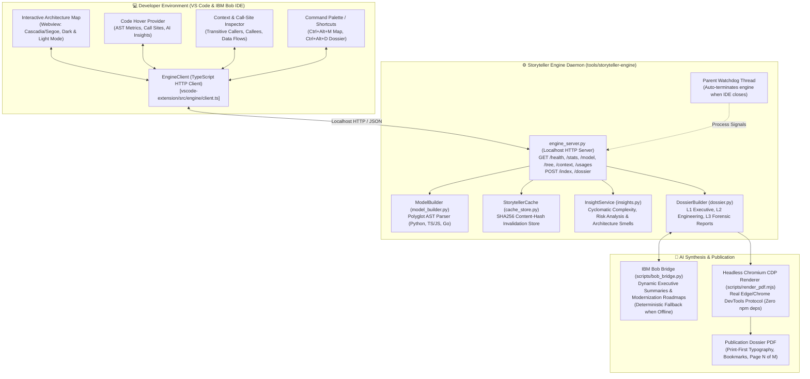

# 🏛️ Architecture Storyteller 2.0
> **Unified Polyglot Architecture Navigator, Interactive Mindmap & Publication Dossier Engine for VS Code & IBM Bob IDE**

---

## ⚡ Executive Summary

**Architecture Storyteller 2.0** transforms complex polyglot software repositories into living, interactive architectural models. It replaces fragmented reverse-engineering scripts and heavyweight IDE extensions with a **single, long-lived Python architecture engine** communicating over high-speed localhost HTTP with a modular **VS Code / IBM Bob extension**.

Whether inspecting symbol call graphs on hover, navigating an interactive tree-first architecture map, or publishing an executive-ready architectural dossier PDF, **every view is guaranteed zero drift** because all consumers share the same underlying AST model and cache store.

---

## 🏗️ System Architecture



---

## 🔑 Key Capabilities

1. **Zero-Drift Architecture Model**:
   - The entire codebase (Python, TypeScript, JavaScript, Go) is extracted by `tools/storyteller-engine` into a unified AST graph.
   - Code hovers, interactive tree views, dependency graphs, and PDF dossiers all query the exact same model.

2. **Long-Lived Localhost HTTP Daemon**:
   - Eliminates expensive per-interaction process spawning (`python cli.py ...`).
   - Starts instantly and runs as a child of the IDE extension host with a robust **parent watchdog thread** that detects abrupt host terminations and frees system resources.

3. **Intelligent Caching & Delta Tracking**:
   - Content hashes (SHA256) per file and symbol ensure indexing is fast and incremental.
   - Re-indexing reports exact deltas (`+added`, `~modified`, `-removed`).

4. **IBM Bob AI Insights & Modernization**:
   - Synthesizes architecture narratives, modernization roadmaps, and symbol rationales using IBM Bob CLI or local LLMs.
   - Provenance is explicitly tracked (`source: bob`, `source: llm`, or `source: auto/deterministic`).
   - If AI credentials are offline, the engine seamlessly provides deterministic static fallbacks with 100% complete documents.

5. **Production Publication Dossiers (L1, L2, L3)**:
   - **Level 1 (Executive)**: KPIs, executive summary, high-level context diagram, top risk factors.
   - **Level 2 (Engineering)**: Module dependency graphs, call flows, route/model catalogs, ranked key functions, clusters.
   - **Level 3 (Forensic)**: Full symbol registry, call sites, git backstory, dynamic-risk matrix, cycles, and churn.
   - Rendered using Node.js's native WebSocket connection to installed Chromium/Edge via DevTools Protocol without bloated dependencies.

6. **Adaptive Light & Dark Mode**:
   - Full support for VS Code dark themes (`vscode-dark`, `vscode-high-contrast`) and light themes.
   - High-contrast accessible color tokens (WCAG AA compliant) with zero contrast clashing on tree rows, hover highlights, and callouts.

---

## 📁 Repository Structure

```
.
├── .vscode/                               # Workspace IDE configuration
│   ├── launch.json                        # F5 Extension Development Host debug configuration
│   ├── settings.json                      # Workspace storyteller settings
│   └── tasks.json                         # Pre-launch TypeScript compilation tasks
├── scripts/                               # Cross-platform automation scripts
│   ├── bob_bridge.py                      # IBM Bob CLI / LLM integration bridge
│   ├── install_extension.py               # Polyglot IDE installer (VS Code & IBM Bob IDE)
│   └── render_pdf.mjs                     # Native Chromium CDP DevTools PDF generator
├── tools/
│   ├── py-ast-core/                       # Polyglot AST analysis core
│   │   ├── ast_extractor.py               # AST visitor and symbol identification
│   │   ├── dynamic_detector.py            # Dynamic runtime and reflection detection
│   │   ├── pdf_generator.py               # Core PDF layout engine
│   │   └── tests/test_ast_core.py         # AST parser unit tests
│   └── storyteller-engine/                # Long-lived Storyteller 2.0 backend daemon
│       ├── cache_store.py                 # Content-hash caching and delta computation
│       ├── cli.py                         # Unified command-line interface
│       ├── dossier.py                     # Publication dossier HTML builder
│       ├── engine_server.py               # Localhost HTTP server with parent watchdog
│       ├── insights.py                    # Complexity and architectural smell generator
│       ├── model_builder.py               # In-memory repository model builder
│       └── tests/                         # Engine test suite (35 tests)
│           ├── test_dossier_render.py     # Dossier HTML contract tests
│           ├── test_engine_server.py      # HTTP API endpoint tests
│           ├── test_insights_cache.py     # Cache invalidation tests
│           ├── test_model_and_cache.py    # Model construction tests
│           └── test_parent_watchdog.py    # Process lifecycle and watchdog tests
└── vscode-extension/                      # Architecture Storyteller IDE extension
    ├── media/
    │   └── map.css                        # Theme-adaptive stylesheet (Dark & Light)
    ├── package.json                       # Extension manifest (v2.1.1)
    ├── scripts/
    │   ├── finalize_webview.mjs           # Classic webview script post-processor
    │   ├── preview_map.mjs                # Offline map visualizer
    │   ├── preview_shell.mjs              # Shell layout debugger
    │   └── test_locate.mjs                # Engine discovery test harness (16 checks)
    ├── src/
    │   ├── extension.ts                   # Extension lifecycle and command dispatcher
    │   ├── commands/dossier.ts            # Dossier preview and PDF export handlers
    │   ├── engine/
    │   │   ├── client.ts                  # EngineClient HTTP client
    │   │   ├── locate.ts                  # Path & virtualenv discovery engine
    │   │   └── types.ts                   # Protocol types and data schemas
    │   └── views/
    │       ├── contextPanel.ts            # Symbol context and call-site inspector
    │       ├── documentPanel.ts           # Read-only document panel manager
    │       ├── hoverProvider.ts           # Editor code hover provider
    │       ├── mapPanel.ts                # Webview panel manager
    │       └── webview/map.ts             # Tree-first architecture map client
    ├── tsconfig.json                      # Extension host TypeScript config
    └── tsconfig.webview.json              # Webview client TypeScript config
```

---

## 🚀 Quick Start & Installation

### Prerequisites
- **Python**: Version 3.10 or newer (with `pytest` installed).
- **Node.js**: Version 18 or newer.
- **IDE**: Microsoft Visual Studio Code and/or IBM Bob IDE.
- **Browser**: Microsoft Edge or Google Chrome (used by `render_pdf.mjs` for PDF compilation).

### One-Command Polyglot Installation
To compile, package, and install Architecture Storyteller into both **VS Code** and **IBM Bob IDE**:

```bash
python scripts/install_extension.py
```

This automated runner:
1. Compiles the TypeScript extension host and webview assets (`npm run compile`).
2. Packages a clean, standalone VSIX (`architecture-storyteller-2.1.1.vsix`).
3. Installs the extension into VS Code (`code --install-extension`) and IBM Bob IDE (`bobide --install-extension`).
4. Verifies installation via IDE CLI queries.

---

## 📖 Operating Manual

### 1. In-Editor Shortcuts & Commands
After installing, open any repository in VS Code or IBM Bob IDE:
- **`Ctrl+Alt+M`** (Mac: `Cmd+Alt+M`): Open the **Interactive Architecture Map**.
- **`Ctrl+Alt+D`** (Mac: `Cmd+Alt+D`): Open the **Publication Dossier HTML Preview**.
- **Hover on Code**: Move the cursor over any class, function, or method to inspect callers, callees, complexity, and stored AI insights.
- **Context Menu**: Right-click code and select **Inspect Code Dependencies & Callers** or **Show Symbol Context**.

### 2. Command Palette (`Ctrl+Shift+P`)
- `Architecture Storyteller: Open Architecture Map`
- `Architecture Storyteller: Preview Publication Dossier (HTML)`
- `Architecture Storyteller: Generate Deep Publication PDF (Chromium)`
- `Architecture Storyteller: Re-index Workspace`
- `Architecture Storyteller: Show Symbol Context`
- `Architecture Storyteller: Show Call Sites`

### 3. Command Line Interface (`cli.py`)
All engine capabilities are accessible from your terminal:

```bash
# Index the current repository
python tools/storyteller-engine/cli.py index

# Preview executive summary dossier
python tools/storyteller-engine/cli.py dossier --level 1

# Generate publication-grade Engineering Dossier PDF (Level 2)
python tools/storyteller-engine/cli.py dossier --level 2 --pdf

# Inspect a specific symbol's call graph
python tools/storyteller-engine/cli.py context --symbol "TripService"

# Query call-sites of a function
python tools/storyteller-engine/cli.py usages --symbol "load_trip"

# Run the long-lived HTTP daemon standalone (Port 8003)
python tools/storyteller-engine/cli.py serve --port 8003
```

---

## 🧪 Verification & Test Suites

The codebase includes two independent test suites verifying 100% of engine and extension contracts:

### 1. Storyteller Engine Test Suite
Tests in `tools/storyteller-engine/tests` cover model builders, HTTP APIs, content-hash caching, dossier formatting, and parent process watchdogs:
```bash
pytest tools/storyteller-engine/tests
# Result: 35 passed in ~47s
```

### 2. Extension Engine Discovery Tests
Verifies path resolution, virtualenv candidate selection, and cross-workspace discovery:
```bash
cd vscode-extension
npm run test:locate
# Result: all checks passed (16/16 ok)
```

---

## 👥 Contributors & Collaborators

- **Jash Jain** (`jashjain-1`)
- **Harsh Mange** (`yellowducksys`)
- **Bhargavi Wakkar** (`bhargaviwakkar25-droid`)
- **Anjali Furia** (`Anjali-Furia`)

---

*Clean Submission Build — Architecture Storyteller 2.0*
