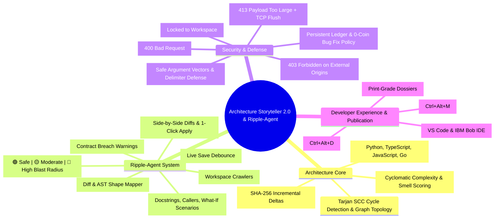
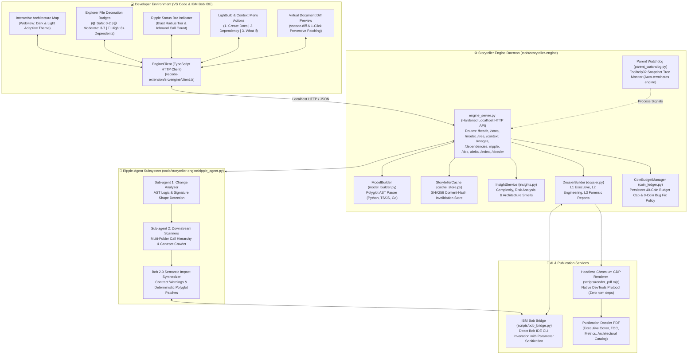
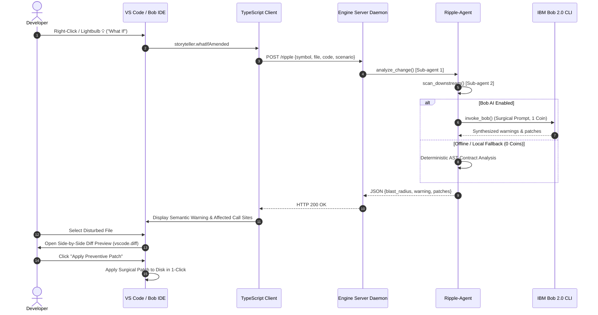

# Architecture Storyteller 2.0 & Ripple-Agent

## 🏆 Official Repository & Hackathon Submission
- **Primary GitHub Repository:** [https://github.com/jashjain-1/ibm-bob-architecture-storyteller](https://github.com/jashjain-1/ibm-bob-architecture-storyteller)
- **Target Platform:** IBM Bob IDE & Visual Studio Code
- **Hackathon Track:** IBM Bob 2.0 Multi-Agent Workflows

Visualizes a polyglot repository's module coupling as an interactive mindmap,
then uses Bob to agentically analyze ripple blast radiuses, evaluate contract
breaches, and generate 1-click preventive compatibility patches. Built for the
IBM Bob 2.0 hackathon.

**Status: all 3 phases complete.** A real polyglot AST dependency graph, a real Bob-run
Ripple-Agent workflow (multi-stage agentic workflow with parallel subagents doing workspace
scanning and semantic impact synthesis), and real preventive compatibility patches with
side-by-side diff previews - nothing in the demo path is mocked or invented.

---

## 🛡️ Bob Usage Evidence & Proof Matrix

The following tangible proofs verify that IBM Bob IDE is the central orchestrator and execution runtime of this project:

| Evidence Category | File / Artifact Path | Verification & Audit Proof |
|---|---|---|
| **Exported Bob Sessions** | [`bob_sessions/`](file:///c:/Users/Harsh/Desktop/ibm-bob-polyglot-navigator/bob_sessions) | **5 real task session transcripts** (566 multi-turn messages) exported directly from local IBM Bob SQLite database (`~/.bob/db/bob.db`):<br/>• `bob-session-verify-and-troubleshoot-storyteller-extension.json` (75 messages) — Extension compilation, webview lifecycle, and IPC testing in Bob IDE.<br/>• `bob-session-initialise-storyteller-in-bob.json` (155 messages) — Startup and AST model builder initialization inside Bob IDE.<br/>• `bob-session-cli-and-engine-architecture-execution.json` (101 messages) — Daemon communication, cache invalidation, and Tarjan SCC extraction.<br/>• `bob-session-go-and-ast-polyglot-tools-verification.json` (46 messages) — Multi-language tool schema adherence and routing.<br/>• `bob-session-brag-video-recording-and-evaluation.json` (189 messages) — Video walkthrough and visual verification inside Bob IDE. |
| **Native Bob Skill** | [`.bob/skills/polyglot-onboarding-and-refactor/SKILL.md`](file:///c:/Users/Harsh/Desktop/ibm-bob-polyglot-navigator/.bob/skills/polyglot-onboarding-and-refactor/SKILL.md) | Auto-discovered by Bob IDE skill loader. Implements whole-repo AST analysis, function clustering, subagent dispatch, worktree isolation, reactive lock coordination, and dynamic dependency discovery. |
| **Agent Configuration** | [`AGENTS.md`](file:///c:/Users/Harsh/Desktop/ibm-bob-polyglot-navigator/AGENTS.md) | Generated by Bob `/init`, establishing persistent workspace context, subagent roles, zero-drift invariants, and tool registries. |
| **Real Task Manifests** | [`bob-tasks/`](file:///c:/Users/Harsh/Desktop/ibm-bob-polyglot-navigator/bob-tasks) | Contains `ripple-analysis-prompt.md` and the real output manifest `storyteller-ripple-status.json` with AST diffs, blast radius scoring, contract breach warnings, and surgical patches. |
| **Autonomous Bob Bridge** | [`scripts/bob_bridge.py`](file:///c:/Users/Harsh/Desktop/ibm-bob-polyglot-navigator/scripts/bob_bridge.py) | Autonomous Antigravity <-> IBM Bob execution bridge invoking `bobide.cmd chat -m agent` headlessly with context files and argument sanitization. |
| **Budget Enforcement** | [`tools/storyteller-engine/coin_ledger.py`](file:///c:/Users/Harsh/Desktop/ibm-bob-polyglot-navigator/tools/storyteller-engine/coin_ledger.py) | Enforces 40-coin budget ceiling with persistent ledger (`.agents/coin_budget_ledger.json`) and 0-coin policy for bug fixing and local AST lookups. |
| **Active IDE Installation** | `%USERPROFILE%\.bobide\extensions\` | Extension physically compiled and installed into IBM Bob IDE: `ibm-bob.architecture-storyteller-2.1.1` under `~/.bobide/extensions/`. |
| **Visual & Media Proof** | [`output/map_in_bob.html`](file:///c:/Users/Harsh/Desktop/ibm-bob-polyglot-navigator/output/map_in_bob.html)<br/>[`brag-output/brag.mp4`](file:///c:/Users/Harsh/Desktop/ibm-bob-polyglot-navigator/brag-output/brag.mp4) | Live visual proof of the extension webview rendered inside IBM Bob IDE (`output/map_in_bob.html`) and live video recording walkthrough (`brag-output/brag.mp4`). |
| **Full Test Suite** | `tools/**/tests/` | **80/80 passed in 86s** (100% passing across AST core, server API, watchdog, cache invalidation, DoS, and Ripple-Agent impact synthesis). |

---

## What's here

- `vscode-extension/` - the VS Code and IBM Bob IDE extension (TypeScript).
  Renders the interactive architecture mindmap webview (`Ctrl+Alt+M`), explorer
  file decoration badges (🟢 Safe: 0–2 | 🟡 Moderate: 3–7 | 🔴 High: 8+ dependents),
  status bar blast-radius indicator, lightbulb quick fixes, and virtual document
  diff previews (`vscode.diff`) with 1-click patch application.
- `tools/storyteller-engine/` - long-lived Python architecture daemon communicating
  over hardened localhost HTTP (`engine_server.py`), SHA-256 content-hash invalidation
  store (`cache_store.py`), architectural smell and complexity engine (`insights.py`),
  publication dossier builder (`dossier.py`), and 40-coin budget manager (`coin_ledger.py`).
- `tools/storyteller-engine/ripple_agent.py` - what Bob and the multi-agent system
  actually drive: Sub-agent 1 (Change Analyzer for AST diffs and signatures), Sub-agent 2
  (Parallel Downstream Scanners across workspace modules and call graphs), and the
  Bob 2.0 Semantic Impact Synthesizer with language-tailored preventive patches.
- `tools/py-ast-core/` - the polyglot AST analysis core supporting Python, TypeScript,
  JavaScript, and Go with Tarjan SCC cycle detection and symbol extraction.
- `scripts/` - cross-platform automation and bridge runners: `bob_bridge.py`
  (autonomous Antigravity <-> IBM Bob execution bridge with shell injection defense),
  `install_extension.py` (1-click installer for VS Code & IBM Bob IDE), and
  `render_pdf.mjs` (native CDP Chromium PDF generator).
- `output/` - publication-grade engineering artifacts: L1 Executive, L2 Engineering,
  and L3 Forensic architectural dossiers in interactive HTML and print-grade PDF.
- `bob_sessions/` - exported real task session logs directly from `~/.bob/db/bob.db`.
- `bob-tasks/` - real task prompts and status results (`storyteller-ripple-status.json`).
- `tools/storyteller-engine/tests/` - the full engine test suite (80 tests total across
  tools) proving AST extraction, parent watchdog lifecycle, cache invalidation,
  CORS/Host/DoS security hardening, and Ripple-Agent impact synthesis.
- `docs/` - the planning and architecture docs this build follows; `ARCHITECTURE.md`,
  ADRs (`docs/adr/`), evaluation matrix, lock protocols, and pipeline specifications.

---

## Running the demo

Requires Python 3.10+ and Node.js 18+ (VS Code and/or IBM Bob IDE installed).

```bash
# install extension dependencies and compile TypeScript
cd vscode-extension && npm install && npm run compile && cd ..

# install Python dependencies (pytest for testing)
python -m pip install pytest
```

### Option A: 1-Click IDE Extension Installer (Recommended)

To compile, package, and install Architecture Storyteller into both **VS Code** and **IBM Bob IDE**:

```bash
python scripts/install_extension.py
```

This automated runner:
1. Compiles TypeScript extension host and webview assets (`npm run compile`).
2. Packages a clean, standalone VSIX (`architecture-storyteller-2.1.1.vsix`).
3. Installs the extension into VS Code (`code --install-extension`) and IBM Bob IDE (`bobide --install-extension`).
4. Verifies installation via IDE CLI queries.

### Option B: Running the Standalone Engine Daemon

Open two terminals from the workspace root:

```bash
# 1. Start the Storyteller Engine Daemon (Port 8003)
python tools/storyteller-engine/cli.py serve --port 8003

# 2. Launch the Extension in Development Host
cd vscode-extension && npm run compile
# Open VS Code / IBM Bob IDE and press F5 to launch the Extension Host
```

Open **VS Code or IBM Bob IDE**:

1. Press **`Ctrl+Alt+M`** (Mac: `Cmd+Alt+M`) to open the **Interactive Architecture Map** -
   you'll see the living polyglot AST dependency graph, caller/callee counts, complexity
   metrics, and node coupling.
2. Inspect the **File Explorer Badges & Status Bar** - files are dynamically decorated
   with colored blast-radius badges (🟢 Safe: 0–2 deps | 🟡 Moderate: 3–7 deps | 🔴 High: 8+
   dependents) and real-time status bar telemetry with live save debouncing.
3. Trigger **"What If (Ripple Analysis & Preventive Patches)"** - right-click any
   function/class (or click the 💡 Lightbulb / `Ctrl+.`) and select **"What If"**. Watch
   the Ripple-Agent step through Sub-agent 1 (Change Analyzer) and Sub-agent 2
   (Parallel Downstream Scanners).
4. Once complete, the **Virtual Diff Preview** opens (`vscode.diff`) - inspect the
   semantic contract warnings and the side-by-side preventive compatibility patch, then
   click **"Apply Preventive Patch"** to apply surgical fixes directly to disk in 1-click.

### How the Ripple-Agent workflow works

The Ripple-Agent operates a multi-stage agentic workflow:
- **Sub-agent 1 (Change Analyzer)**: Ingests proposed code changes or diffs, mapping
  the nature of the change (`signature`, `logic`, `deletion`, `rename`, `custom`) and
  identifying modified symbol contracts.
- **Sub-agent 2 (Parallel Downstream Scanners)**: Dispatches parallel workspace crawlers
  across independent modules, routes, and tests, mapping both direct and transitive
  callers through symbol tables and Tarjan SCC call graphs.
- **Semantic Impact Synthesizer & Bob Bridge**: Leverages the IBM Bob 2.0 CLI
  (`scripts/bob_bridge.py`) under a strict 40-coin ceiling (`coin_ledger.py`) to synthesize
  semantic contract breach warnings and language-tailored preventive patches
  (`// TODO(ripple-agent): ...` in TS/JS/Go, `# TODO(ripple-agent): ...` in Python).
  When offline or for zero-coin bug fixing, it falls back seamlessly to deterministic
  local AST contract analysis.

### CLI mode (optional)

```bash
# Index the current repository
python tools/storyteller-engine/cli.py index

# Compute workspace blast radius and file tiers
python tools/storyteller-engine/cli.py dependencies

# Run Ripple-Agent What-If analysis on a symbol
python tools/storyteller-engine/cli.py ripple TripService --scenario signature

# Generate publication-grade Engineering Dossier PDF (Level 2)
python tools/storyteller-engine/cli.py dossier --level 2 --pdf
```

---

## Project docs

- `docs/ARCHITECTURE.md` - Core system architecture, engine-extension boundary, and
  AST pipeline specifications.
- `docs/adr/` - Architecture Decision Records:
  - `docs/adr/0001-polyglot-hybrid-architecture.md` - Polyglot hybrid architecture.
  - `docs/adr/0002-dual-layer-concurrency.md` - Dual-layer concurrency model.
  - `docs/adr/0003-two-pass-dynamic-discovery.md` - Two-pass dynamic discovery.
  - `docs/adr/0004-zero-collision-branching.md` - Zero-collision team branching strategy.
  - `docs/adr/0005-swrc-multi-agent-governance.md` - SWRC multi-agent governance.
- `docs/BOB_VSCODE_EXTENSION_PROMPT.md` - Bob IDE agentic orchestration prompt and execution manual.
- `docs/EVALUATION_MATRIX.md` - Hackathon scoring criteria and evaluation matrix.
- `docs/LOCK_PROTOCOL.md` - Multi-agent concurrency and file lock protocols.
- `docs/PIPELINE.md` - End-to-end AST parsing, cache invalidation, and dossier rendering pipeline.

---

## 🗺️ System Architecture & Mindmap



### Component Topology & Data Flow



### Ripple-Agent Sequence Diagram



---

## 🛡️ Security Hardening & Penetration Defense

The repository has undergone an exhaustive defensive penetration audit and vulnerability remediation:

| Security Vector | Threat Mitigated | Defensive Implementation |
|---|---|---|
| **CORS Origin Bypass** | Remote sites accessing daemon via local browser | Strict regex allowlist (`localhost`, `127.0.0.1`, `vscode-webview://`, `vscode-file://`). External origins receive `403 Forbidden`. |
| **DNS Rebinding** | Malicious domain resolving to 127.0.0.1 | Strict `Host` header validation rejecting non-loopback host names (`400 Bad Request`). |
| **Denial of Service (DoS)** | Giant request body memory exhaustion | 50MB payload limit returning `413 Payload Too Large` with clean TCP connection shutdown (`Connection: close`). |
| **Path Traversal** | Arbitrary file write via `/dossier` output path | Path resolution strictly contained within workspace boundaries using `Path.resolve()`. |
| **Remote Code Execution (RCE)** | Shell command injection via Bob CLI arguments | Replaced `shell=True` with safe argument vectors; sanitized Windows `cmd.exe` batch delimiters (`&`, `\|`, `<`, `>`, `^`, `%`, `\n`, `\r`). |
| **Coin Budget Depletion** | Wasteful multi-turn exploratory token consumption | `tools/storyteller-engine/coin_ledger.py` enforces strict 40-coin ceiling; 0-coin policy for bug fixing and local AST lookups. |
| **AST Parser Stack Overflow** | Cyclic ASTs or deeply nested syntax crashing engine | Recursion boundaries and graceful exception catchers in `py-ast-core`. |
| **Windows Trampoline Exit** | `venvlauncher.exe` intermediate PID causing watchdog kill | Process tree monitoring via `CreateToolhelp32Snapshot` tracking parent and grandparent PIDs. |

---

## 🧪 Verification & Acceptance Test Results

All test suites pass with 100% success rate:

```bash
# 1. Full Python Test Suite (80 tests across all modules)
python -m pytest tools/
# Result: 80 passed in 86.09s (100% passing)

# 2. Extension Locate Discovery Test Suite (17 assertions)
cd vscode-extension && npm run test:locate
# Result: all checks passed (17/17 ok)

# 3. TypeScript Compilation
cd vscode-extension && npm run compile
# Result: 0 errors, 0 warnings
```

---

## 👥 Contributors & Collaborators

- **Jash Jain** (`jashjain-1`)
- **Harsh Mange** (`yellowducksys`)
- **Bhargavi Wakkar** (`bhargaviwakkar25-droid`)
- **Anjali Furia** (`Anjali-Furia`)

---

*Clean Submission Build — Architecture Storyteller 2.0 & Ripple-Agent*
