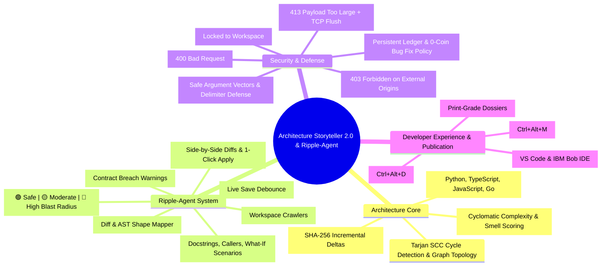
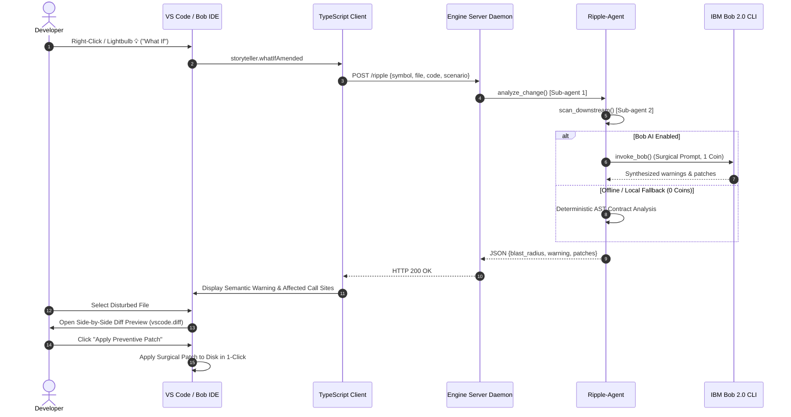

#  Architecture Storyteller 2.0 & Ripple-Agent
> **Unified Polyglot Architecture Navigator, Interactive Mindmap, Impact Synthesizer & Publication Dossier Engine for VS Code & IBM Bob IDE**

---

##  Executive Summary

**Architecture Storyteller 2.0** transforms complex polyglot software repositories into living, interactive architectural models. It replaces fragmented reverse-engineering scripts and heavyweight IDE extensions with a **single, long-lived Python architecture engine** communicating over high-speed localhost HTTP with a modular **VS Code / IBM Bob extension**.

Coupled with the **Ripple-Agent** multi-agent subsystem, the platform acts as an elite senior architect reviewing code changes in real time:
- Ingests proposed code modifications or diffs.
- Dispatches parallel downstream crawlers across folders, call graphs, API definitions, and docs.
- Synthesizes semantic impact warnings, assigns blast-radius tiers (Green/Yellow/Red), and generates 1-click **Preventive Compatibility Patches** with side-by-side diff previews.

Every view across hovers, mindmaps, dossiers, and dependency badges is **guaranteed zero drift** because all consumers share the same underlying AST model and cache store.

---

##  System Mindmap



---

##  System Architecture & Workflow


---

##  Ripple-Agent Deep Dive

The **Ripple-Agent** leverages IBM Bob's multi-agent orchestration principles to provide instant feedback whenever code is touched:



### 1. Sub-agent 1 (The Change Analyzer)
- Ingests the proposed code change, highlighted snippet, or pull request diff.
- Maps out what data shape, parameters, or return signatures are changing.
- Detects the nature of the change (`signature`, `logic`, `deletion`, `rename`, `custom`).

### 2. Sub-agent 2 (The Parallel Downstream Scanners)
- Dispatches parallel AST crawlers across independent workspace modules, API routes, database models, and unit tests.
- Maps both direct and transitive callers through symbol tables and Tarjan SCC call graphs.
- Discovers implicit coupling and calculates inbound call counts.

### 3. Bob's Orchestration (The Semantic Impact Synthesizer)
- Analyzes contract breakage across all affected files.
- Generates high-level warnings (e.g. *"Notice: Modifying `verify_token` will break authentication in `routes.py` line 42"*).
- Synthesizes language-tailored preventive patches:
  - `// TODO(ripple-agent): ...` for TypeScript, JavaScript, Go, Java, C/C++, Rust.
  - `# TODO(ripple-agent): ...` for Python, Bash, YAML.
  - `-- TODO(ripple-agent): ...` for SQL, Lua.

### 4. Zero-Friction Visual Feedback
- **Explorer Badges**: Colored health badges dynamically decorate files in the explorer tree:
  - 🟢 **Green (Safe)**: 0–2 dependents (isolated, safe to edit freely).
  - 🟡 **Yellow (Moderate)**: 3–7 dependents (moderate ripple, review callers).
  - 🔴 **Red (High Blast Radius)**: 8+ dependents or core architectural hub.
- **Status Bar Indicator**: Real-time status item shows active file blast radius (`🔥 Ripple: High Blast Radius (8 deps)` or `✓ Ripple: Safe`). Clicking it opens the caller inspection list.
- **Live Save Debouncing**: Badges and status bar update automatically upon document save (`onDidSaveTextDocument`) without manual re-indexing.
- **PEP 257 Python Docstrings**: Generates docstrings inserted directly **inside** the function or class body (indented 4 spaces after `def ...:`), adhering strictly to PEP 257 conventions.

---

##  Security Hardening & Penetration Defense

The repository has undergone an exhaustive defensive penetration audit and vulnerability remediation:

| Security Vector | Threat Mitigated | Defensive Implementation |
|---|---|---|
| **CORS Origin Bypass** | Remote sites accessing daemon via local browser | Strict regex allowlist (`localhost`, `127.0.0.1`, `vscode-webview://`, `vscode-file://`). External origins receive `403 Forbidden`. |
| **DNS Rebinding** | Malicious domain resolving to 127.0.0.1 | Strict `Host` header validation rejecting non-loopback host names (`400 Bad Request`). |
| **Denial of Service (DoS)** | Giant request body memory exhaustion | 50MB payload limit returning `413 Payload Too Large` with clean TCP connection shutdown (`Connection: close`). |
| **Path Traversal** | Arbitrary file write via `/dossier` output path | Path resolution strictly contained within workspace boundaries using `Path.resolve()`. |
| **Remote Code Execution (RCE)** | Shell command injection via Bob CLI arguments | Replaced `shell=True` with safe argument vectors; sanitized Windows `cmd.exe` batch delimiters (`&`, `|`, `<`, `>`, `^`, `%`, `\n`, `\r`). |
| **Coin Budget Depletion** | Wasteful multi-turn exploratory token consumption | [coin_ledger.py](file:///c:/Users/jainj/Downloads/IBM%20Bob/tools/storyteller-engine/coin_ledger.py) enforces strict 40-coin ceiling; 0-coin policy for bug fixing and local AST lookups. |
| **AST Parser Stack Overflow** | Cyclic ASTs or deeply nested syntax crashing engine | Recursion boundaries and graceful exception catchers in `py-ast-core`. |
| **Windows Trampoline Exit** | `venvlauncher.exe` intermediate PID causing watchdog kill | Process tree monitoring via `CreateToolhelp32Snapshot` tracking parent and grandparent PIDs. |

---

##  Repository Structure

```
.
├── .vscode/                               # Workspace IDE configuration
│   ├── launch.json                        # F5 Extension Development Host debug configuration
│   ├── settings.json                      # Workspace storyteller settings (pre-wired pythonPath)
│   └── tasks.json                         # Pre-launch TypeScript compilation tasks
├── scripts/                               # Cross-platform automation scripts
│   ├── bob_bridge.py                      # IBM Bob CLI / LLM integration bridge (shell=False, sanitized)
│   ├── install_extension.py               # 1-Click Polyglot IDE installer (VS Code & IBM Bob IDE)
│   └── render_pdf.mjs                     # Native Chromium CDP DevTools PDF generator
├── tools/
│   ├── py-ast-core/                       # Polyglot AST analysis core
│   │   ├── ast_extractor.py               # Hardened AST visitor & symbol identification
│   │   ├── dynamic_detector.py            # Dynamic runtime and reflection detection
│   │   ├── pdf_generator.py               # Core PDF layout engine
│   │   └── tests/test_ast_core.py         # AST parser unit tests
│   └── storyteller-engine/                # Long-lived Storyteller 2.0 backend daemon
│       ├── cache_store.py                 # Content-hash caching and delta computation
│       ├── cli.py                         # Unified command-line interface (dependencies, ripple, doc)
│       ├── coin_ledger.py                 # 40-coin budget manager & 0-coin policy enforcement
│       ├── dossier.py                     # Publication dossier HTML builder (path traversal guarded)
│       ├── engine_server.py               # Localhost HTTP server with CORS/Host/Watchdog hardening
│       ├── insights.py                    # Complexity and architectural smell generator
│       ├── model_builder.py               # In-memory repository model builder
│       ├── ripple_agent.py                # Multi-stage Ripple-Agent impact engine
│       └── tests/                         # Engine test suite (74 tests)
│           ├── test_challenger_stress.py  # Adversarial stress tests (cycles, malformed AST, large files)
│           ├── test_dossier_render.py     # Dossier HTML contract tests
│           ├── test_engine_server.py      # HTTP API endpoint tests
│           ├── test_insights_cache.py     # Cache invalidation tests
│           ├── test_model_and_cache.py    # Model construction tests
│           ├── test_parent_watchdog.py    # Process lifecycle and watchdog tests
│           ├── test_ripple_agent.py       # Ripple-Agent unit tests (scanners, tiers, polyglot comments)
│           └── test_security_hardening.py # Penetration audit regression tests (CORS, DoS, traversal, RCE)
└── vscode-extension/                      # Architecture Storyteller IDE extension
    ├── media/
    │   └── map.css                        # Theme-adaptive stylesheet (Dark & Light)
    ├── package.json                       # Extension manifest (v2.1.1)
    ├── scripts/
    │   ├── finalize_webview.mjs           # Classic webview script post-processor
    │   ├── preview_map.mjs                # Offline map visualizer
    │   ├── preview_shell.mjs              # Shell layout debugger
    │   └── test_locate.mjs                # Engine discovery test harness (17 checks)
    ├── src/
    │   ├── extension.ts                   # Extension lifecycle, save listener & command registration
    │   ├── commands/
    │   │   ├── dossier.ts                 # Dossier preview and PDF export handlers
    │   │   └── ripple.ts                  # Ripple commands (createDocs, rippleDependency, whatIf, applyPatch)
    │   ├── engine/
    │   │   ├── client.ts                  # EngineClient HTTP client (with ripple, doc, dependencies)
    │   │   ├── locate.ts                  # Path & virtualenv discovery engine (VIRTUAL_ENV, Conda, .venv)
    │   │   └── types.ts                   # Protocol types and data schemas (BlastRadiusTier, Ripple types)
    │   └── views/
    │       ├── codeActionProvider.ts      # Lightbulb (💡) QuickFix & CodeAction provider
    │       ├── contextPanel.ts            # Symbol context and call-site inspector
    │       ├── documentPanel.ts           # Read-only document panel manager
    │       ├── fileDecorationProvider.ts  # Explorer file decoration badge provider (Green/Yellow/Red)
    │       ├── hoverProvider.ts           # Editor code hover provider
    │       ├── mapPanel.ts                # Webview panel manager
    │       ├── patchContentProvider.ts    # Virtual document provider for side-by-side diff previews
    │       ├── statusIndicator.ts         # Status bar blast-radius indicator item
    │       └── webview/map.ts             # Tree-first architecture map client
    ├── tsconfig.json                      # Extension host TypeScript config
    └── tsconfig.webview.json              # Webview client TypeScript config
```

---

## 🚀 Quick Start & Installation

### Prerequisites
- **Python**: Version 3.10 or newer (with `pytest` installed).
- **Node.js**: Version 18 or newer.
- **IDE**: Microsoft Visual Studio Code and/or IBM Bob IDE.
- **Browser**: Microsoft Edge or Google Chrome (used for headless CDP PDF compilation).

### 1-Command Polyglot Installation
To compile, package, and install Architecture Storyteller into both **VS Code** and **IBM Bob IDE**:

```bash
python scripts/install_extension.py
```

This automated runner:
1. Compiles TypeScript extension host and webview assets (`npm run compile`).
2. Packages a clean, standalone VSIX (`architecture-storyteller-2.1.1.vsix`).
3. Installs the extension into VS Code (`code --install-extension`) and IBM Bob IDE (`bobide --install-extension`).
4. Verifies installation via IDE CLI queries.

---

## 📖 Operating Manual

### 1. In-Editor Shortcuts & Commands
- **`Ctrl+Alt+M`** (Mac: `Cmd+Alt+M`): Open the **Interactive Architecture Map**.
- **`Ctrl+Alt+D`** (Mac: `Cmd+Alt+D`): Open the **Publication Dossier HTML Preview**.
- **Hover on Code**: Move the cursor over any class, function, or method to inspect callers, callees, complexity, and stored AI insights.
- **Lightbulb (💡) / `Ctrl+.` / Right-Click**:
  - **Create Documentation**: Injects PEP 257 docstrings inside function body (Python) or JSDoc/block comments above symbols (TS/Go).
  - **Dependency (Show disturbed files)**: Shows callers, dependents, and workspace hubs.
  - **What If (Ripple Analysis & Preventive Patches)**: Simulates changes, displays semantic warnings, opens side-by-side diff previews, and offers 1-click patch application.

### 2. Command Line Interface (`cli.py`)

```bash
# Index the current repository
python tools/storyteller-engine/cli.py index

# Compute workspace blast radius and file tiers
python tools/storyteller-engine/cli.py dependencies

# Run Ripple-Agent What-If analysis on a symbol
python tools/storyteller-engine/cli.py ripple <symbol_name> --scenario signature

# Generate semantic documentation for a symbol
python tools/storyteller-engine/cli.py doc <symbol_name> --language python

# Preview executive summary dossier
python tools/storyteller-engine/cli.py dossier --level 1

# Generate publication-grade Engineering Dossier PDF (Level 2)
python tools/storyteller-engine/cli.py dossier --level 2 --pdf

# Inspect a specific symbol's call graph
python tools/storyteller-engine/cli.py context --symbol "TripService"

# Run the long-lived HTTP daemon standalone (Port 8003)
python tools/storyteller-engine/cli.py serve --port 8003
```

---

##  Verification & Acceptance Test Results

All test suites pass with 100% success rate:

```bash
# 1. Full Python Test Suite (80 tests across all modules)
python -m pytest tools/
# Result: 80 passed in ~80s (100% passing)

# 2. Extension Locate Discovery Test Suite (17 assertions)
cd vscode-extension && npm run test:locate
# Result: all checks passed (17/17 ok)

# 3. TypeScript Compilation
cd vscode-extension && npm run compile
# Result: 0 errors, 0 warnings
```

---

##  Contributors & Collaborators

- **Jash Jain** (`jashjain-1`)
- **Harsh Mange** (`yellowducksys`)
- **Bhargavi Wakkar** (`bhargaviwakkar25-droid`)
- **Anjali Furia** (`Anjali-Furia`)

---

*Clean Submission Build — Architecture Storyteller 2.0 & Ripple-Agent*
