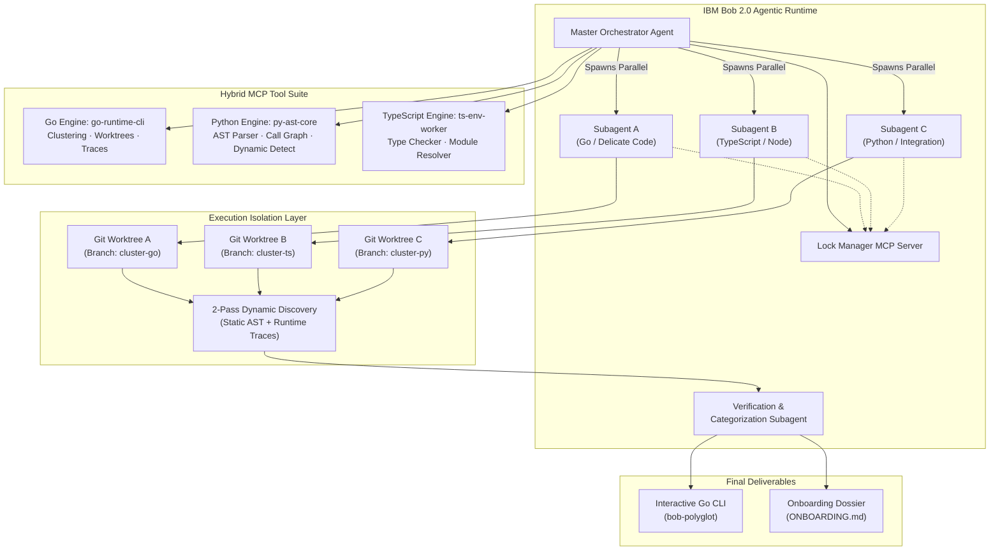
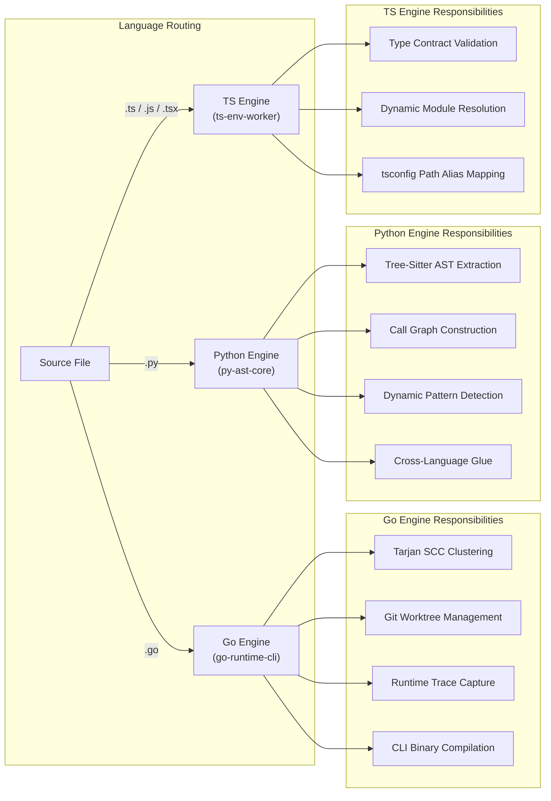
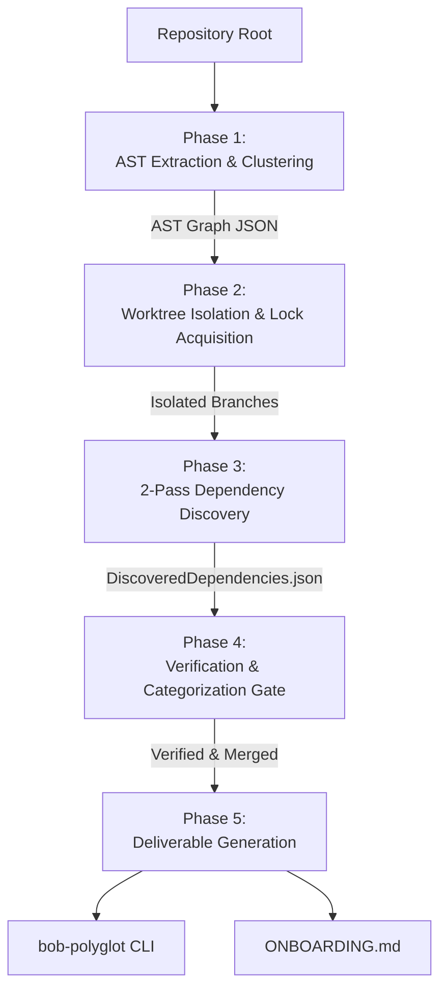

# System Architecture

## High-Level Component Topology

---

## Hybrid Engine Division of Labor

---

## Data Flow Through the 5-Phase Pipeline

---

## Cluster Classification

| Cluster | Name | Description | Worktree Required | Lock Required |
| :---: | :--- | :--- | :---: | :---: |
| **A** | Independent Leaves | Zero outbound internal dependencies. Isolated utilities. | No | No |
| **B** | Interdependent | Mutually calling, shared state/schemas, circular references. | Yes | Yes |
| **C** | Delicate / Dynamic | Reflection, dynamic dispatch, eval, runtime DI, env routing. | Yes | Yes (elevated) |
