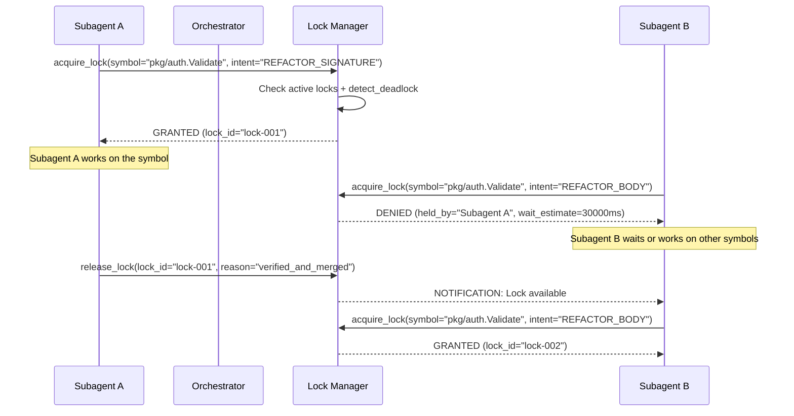
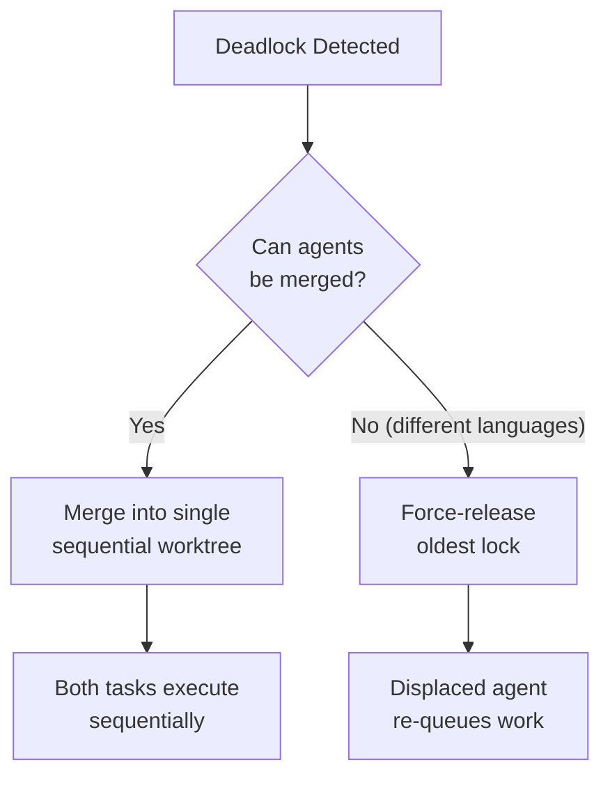

# Lock System Protocol

## Overview

The Polyglot Navigator uses a **Dual-Layer Concurrency Model** to guarantee zero race conditions, merge conflicts, or data corruption when multiple subagents refactor interdependent functions in parallel.

---

## Layer 1: Filesystem Isolation (Git Worktrees)

Subagents **never** edit files in the primary repository directly. Each cluster subagent operates in a physically isolated git worktree.

### Lifecycle

```
create → work → verify → merge → cleanup
```

1. **Create:** `go-runtime-cli:manage_worktree(action="create", branch_name="agent-cluster-<id>")`
2. **Work:** Subagent reads, analyzes, and modifies files only within its worktree.
3. **Verify:** `verification-auditor` runs build/test/lint checks inside the worktree.
4. **Merge:** `go-runtime-cli:manage_worktree(action="merge", branch_name="agent-cluster-<id>")`
5. **Cleanup:** `go-runtime-cli:manage_worktree(action="cleanup", branch_name="agent-cluster-<id>")`

### Directory Layout

```
project-root/
├── .git/                          ← Primary repository
├── src/                           ← Main working tree (untouched by subagents)
└── ../worktrees/
    ├── agent-cluster-auth/        ← Subagent A's isolated workspace
    ├── agent-cluster-api/         ← Subagent B's isolated workspace
    └── agent-cluster-events/      ← Subagent C's isolated workspace
```

---

## Layer 2: Symbol-Level Locks (Reactive MCP Protocol)

Even with worktree isolation, subagents may need to modify the **same logical symbol** (e.g., a shared interface definition). The lock manager prevents this.

### Lock Types

| Intent | Lock Mode | Description |
| :--- | :--- | :--- |
| `READ` | **Shared** | Multiple subagents can read simultaneously. |
| `DOCUMENT` | **Exclusive** | Writing documentation/comments for a symbol. |
| `REFACTOR_BODY` | **Exclusive** | Modifying function internals without signature changes. |
| `REFACTOR_SIGNATURE` | **Exclusive** | Changing function signatures, types, or contracts. |
| `DELETE` | **Exclusive** | Removing a symbol entirely. |

### Protocol Flow



### Co-Locking (Interdependent Symbols)

When a subagent acquires a lock on a symbol, it can specify `interdependent_symbols` to co-lock related symbols atomically:

```json
{
  "symbol_id": "pkg/auth.ValidateToken",
  "file_path": "/src/pkg/auth/validate.go",
  "agent_id": "go-subagent-cluster-auth",
  "intent": "REFACTOR_SIGNATURE",
  "interdependent_symbols": [
    "pkg/auth.RefreshToken",
    "pkg/db.UserSession"
  ]
}
```

All three symbols are locked together. If any one is already held, the entire request is denied.

---

## Deadlock Detection & Resolution

### What Is a Deadlock?

A circular wait: Subagent A holds Lock X and waits for Lock Y, while Subagent B holds Lock Y and waits for Lock X.

### Detection

Before every `acquire_lock`, the lock manager runs `detect_deadlock`:

```json
{
  "requesting_agent_id": "subagent-b",
  "requested_symbol_id": "pkg/auth.ValidateToken"
}
```

The lock manager builds a wait-for graph and checks for cycles using depth-first search.

### Resolution Strategy

When a deadlock is detected, the Orchestrator takes one of two actions:

1. **Merge Agents (Preferred):** Combine the two conflicting subagents into a single sequential worktree. Both tasks execute in the same branch, eliminating the circular dependency.

2. **Release Oldest Lock:** Force-release the lock that has been held the longest. The displaced subagent re-queues its work after the conflict is resolved.



---

## Lock Table Schema

The Orchestrator maintains a persistent lock table:

```json
{
  "locks": {
    "lock-001": {
      "symbol_id": "pkg/auth.ValidateToken",
      "file_path": "/src/pkg/auth/validate.go",
      "held_by": "go-subagent-cluster-auth",
      "worktree": "../worktrees/agent-cluster-auth",
      "intent": "REFACTOR_SIGNATURE",
      "locked_at": "2026-09-26T12:00:00Z",
      "interdependent_symbols": [
        "pkg/auth.RefreshToken",
        "pkg/db.UserSession"
      ]
    }
  },
  "wait_queue": [
    {
      "agent_id": "ts-subagent-cluster-api",
      "requested_symbol": "pkg/auth.ValidateToken",
      "requested_intent": "REFACTOR_BODY",
      "queued_at": "2026-09-26T12:00:30Z"
    }
  ]
}
```
