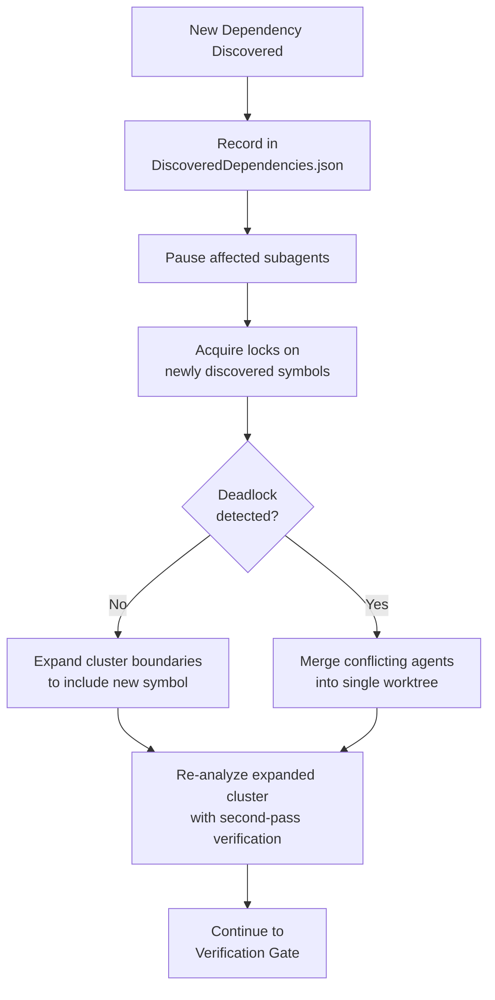
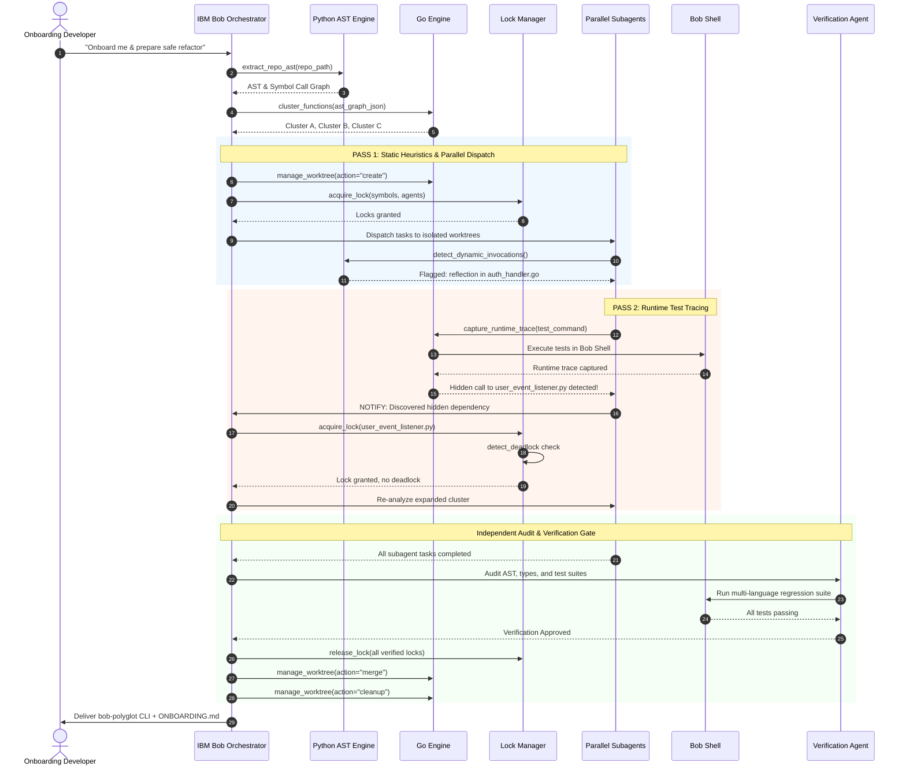

# 2-Pass Dynamic Dependency Discovery Pipeline

## Why Two Passes?

Hidden dependencies — dynamic RPCs, reflection, event buses, environment-conditional code — are the **#1 reason multi-agent refactors break**. Static AST analysis alone misses them. Runtime execution alone is expensive and incomplete without test coverage. The 2-pass approach combines both for maximum safety.

---

## Pass 1: Static Heuristic Analysis

### What It Detects

| Language | Dynamic Pattern | Detection Method |
| :--- | :--- | :--- |
| **Python** | `getattr()`, `importlib.import_module()`, `eval()`, `exec()` | AST node type matching |
| **Python** | `os.environ[]`, `os.getenv()` | Environment-conditional branches |
| **Go** | `reflect.ValueOf()`, `reflect.MethodByName()` | Call expression matching |
| **Go** | `plugin.Open()`, interface dispatch | Type assertion tracking |
| **TypeScript** | `require(variable)`, `import(expression)` | Non-literal import detection |
| **TypeScript** | `eval()`, `new Function()`, event emitters | Dangerous call identification |
| **All** | String-based method dispatch, config-driven routing | Pattern heuristics |

### Execution

```
py-ast-core:detect_dynamic_invocations(
  file_path="/src/pkg/auth/handler.go",
  patterns=["reflection", "dynamic_import", "env_conditional"]
)
```

### Output

Each flagged pattern includes:
- `pattern_type`: Category of dynamic invocation
- `file_path` and `line_number`: Exact location
- `symbol_id`: The function containing the pattern
- `confidence`: 0.0–1.0 score indicating detection certainty
- `description`: Human-readable explanation

---

## Pass 2: Runtime Test Trace Capture

### What It Catches That Pass 1 Misses

- Actual runtime call paths through interfaces and virtual dispatch
- Event listener registrations that fire during test execution
- Configuration-driven routing that only activates with specific env vars
- Plugin loading and dynamic module injection at runtime
- Cross-process RPC calls captured via network tracing

### Execution

```
go-runtime-cli:capture_runtime_trace(
  test_command="go test -v -cover ./...",
  working_directory="../worktrees/agent-cluster-auth",
  trace_output_path="./traces/cluster-auth.json",
  timeout_seconds=300,
  capture_env_vars=true
)
```

For Python:
```
go-runtime-cli:capture_runtime_trace(
  test_command="pytest --tb=short -v",
  working_directory="../worktrees/agent-cluster-py",
  trace_output_path="./traces/cluster-py.json"
)
```

For TypeScript/Node:
```
go-runtime-cli:capture_runtime_trace(
  test_command="npm test",
  working_directory="../worktrees/agent-cluster-ts",
  trace_output_path="./traces/cluster-ts.json"
)
```

---

## Reconciliation Loop

When either pass discovers an unmapped dependency:



### `DiscoveredDependencies.json` Schema

```json
{
  "discovered_at": "2026-09-26T12:15:00Z",
  "pass": 2,
  "source": {
    "symbol_id": "pkg/auth.ValidateToken",
    "file_path": "/src/pkg/auth/validate.go",
    "cluster": "agent-cluster-auth"
  },
  "target": {
    "symbol_id": "pkg/events.UserEventListener",
    "file_path": "/src/pkg/events/user_listener.py",
    "cluster": "agent-cluster-events"
  },
  "call_type": "event",
  "evidence": "Runtime trace: ValidateToken emits 'user.validated' event consumed by UserEventListener",
  "action_taken": "Expanded agent-cluster-auth to include UserEventListener; co-lock acquired"
}
```

---

## End-to-End Sequence


